# 业务方模型调用接入 SOP

# 1 文档目标

本文用于指导外部业务方完成模型 API 调用能力接入，覆盖以下内容：

- 接入前需要准备什么
- 如何申请 `token`、`appID`
- 如何调用 Vendor API 的 `v2` 接口
- 常见报错该如何归因与处理

---

# 2 接入前确认

- **非确定性业务的需求** ，如：调研，实验等，按之前流程，提运维工单，申请厂商 apikey，到期作废，记录费用。
- **有确定性业务** ，参照下述流程
  - **离线任务，请提前说明，暂不允许接入共享资源（Gemini），请提前****单独申请 PT 资源**

# 3 接入流程

---

# 4 接入前准备

## 4.1 业务需准备的信息

- 因 TCS 平台能力仍在开发中，业务方在提单或对接时，先申请确定 TCS **appid** 及 **businessSource。**
  - **appid** 及 **businessSource，** 传值规范，请参照文档下方：7.3 与 7.4 部分
- TCS 平台地址：https://tcs.meta.ai-transsion.com/#/app，TCS 操作文档：TCS 应用申请流程。负责人：
- 查看平台当前支持的模型：https://business-vendor-feature.singapore.ai-transsion.com/business-vap/admin/model-square

## 4.2 平台交付的信息

平台方完成配置后，应向业务方交付：

| 字段 | 说明 | 备注 |
| --- | --- | --- |
| `base_url` | 网关地址，例如 `http://dev.bus.ai-transsion.com` |  |
| `appID` | 应用标识 | 用于申请人信息核对，确认成本分摊维度 |
| `businessSource` | 业务场景标识 | 用于申请人信息核对，确认成本分摊维度 |
| `token` | 平台签发的调用令牌，格式通常为 `sk-***` | 访问 LLM 资源令牌 |
| `~~model_cluster_id~~` | ~~目标模型集群标识，例如 ~~`~~alibaba/qwen~~` | ~~当前访问策略，不支持资源独享，后续将不再对外暴露~~ |
| `routeID` | 路由 ID，例如：`alibaba/qwen-max@singapore@SentryMonitor@AIAlertAssistant` | 业务私有，支持资源独享 |

---

# 5 业务上线测试及生产前确认

- 为避免业务突然上线、新增路由模型资源等，导致测试或生产环境可能出现业务的问题，后续所有业务接入或新增的路由资源，**默认只配置 feature 环境** ，需要上线测试或者生产环境，要提前告知平台侧，并提工单流程，审批通过后，平台进行目标环境的路由资源配置
  - 工单地址：https://modern.transsion.com/bpm/process-instance/create-detail?processDefinitionId=vendor-route-apply%3A6%3A98bbeaba-7c3c-11f1-a2be-2e5b1969679b

# 6 接口文档

API 接口文档地址：https://test-sg.42.ai-transsion.com/procuress/docs/api/1011

---

# 7 协议说明

## 7.1 协议定位

Vendor `v2` 接口不是纯 OpenAI 原生协议，而是：

- 外层：平台统一包装
- 内层：OpenAI 风格标准字段
- 响应：支持 JSON 或 SSE

可理解为：

> OpenAI Chat / Responses 兼容语义 + 平台自定义 `metadata` / `inhouse` 扩展

---

## 7.2  自定义参数透传

协议中定义了自定义参数**vendorExtra，** 用于业务方根据自己的需求，可以透传给模型，透传后的数据组装在最上层

### 7.2.1 调用百度灵医模型，透传 messages 层级参数

请求示例

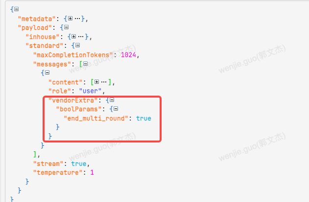

透传效果

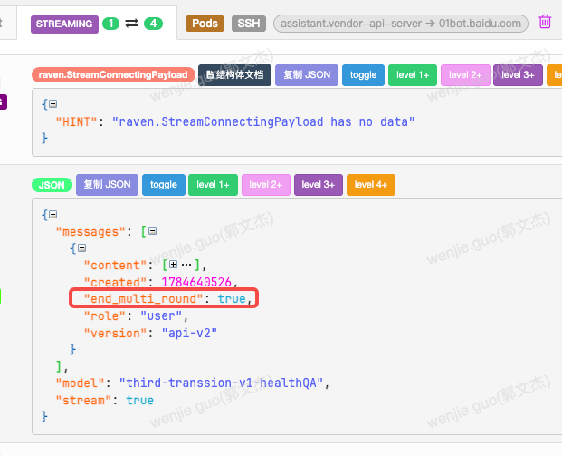

### 7.2.2 调用qwen，关闭think：

调用信息：

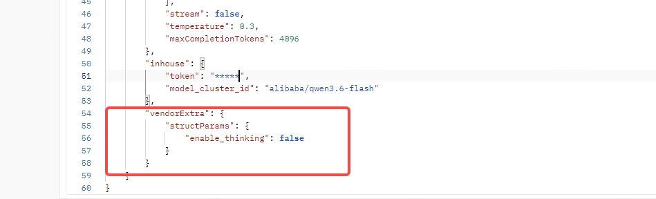

实际效果：

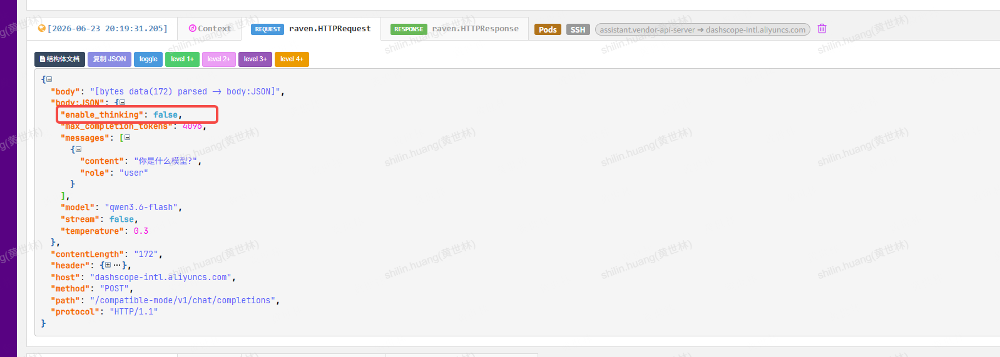

### 7.2.3 调用seed-2.0透传

调用信息

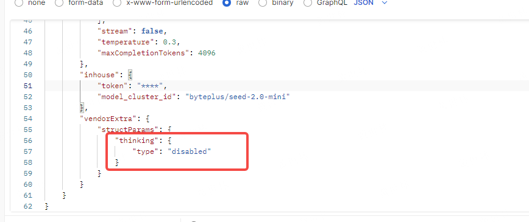

实际效果：

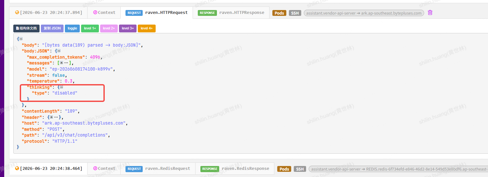

### 7.2.4 调用gemini透传

**显示缓存** 透传**cachedContent** 同下,structParams示例如下：

Gemini 缓存官方：https://ai.google.dev/gemini-api/docs/generate-content/caching?hl=zh-cn#caching-using-openai

```java
{
    "vendorExtra": {
        "structParams": {
            "cachedContent": "projects/705826007842/Locations/eu/cachedContents/8615724736741113856",
            "generationConfig": {
                "thinkingConfig": {
                    "thinkingBudget": 0
                }
            }
        }
    }
}
```

**调用信息：**

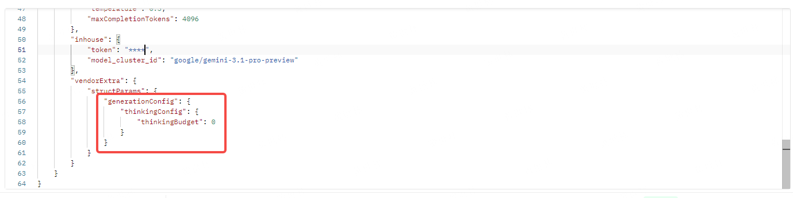

实际效果：

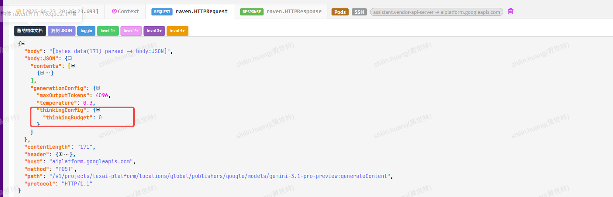

## 7.3 透传模式

注意：**使用输入or输出透传方式，切换模型后业务方也需要做同步改造，vendor没有做额外的映射处理 。** 使用现有的openAI协议，vendor做了映射处理，支持在vendor平台调整路由关联的集群，一键切换模型

### 7.3.1 请求参数透传

 参数方式为和standard平级有vendorExtra，structParan里面可以传三方的参数（和官方文档一致），vendor只是做透传

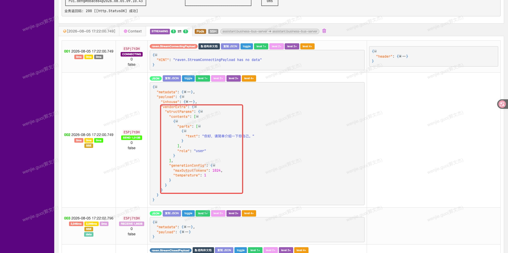

### 7.3.2 响应参数透传

  在请求参数中，传参：inhouse.vendorRawOption.mode=2，响应信息中会返回vendor_raw_response.body

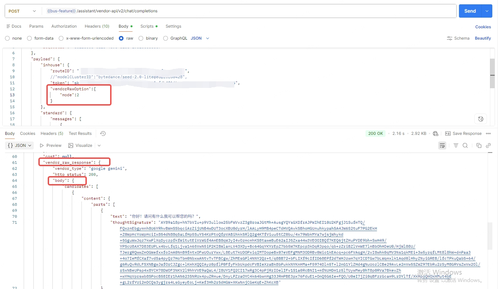

# 8 业务方接入开发规范

## 8.1 Route ID 获取及传值规范

- 根据申请资源信息，由 Vendor 后台进行分配和配置
- routeID 传值规范：务必使用 Vendor 后台配置的 routeID 请求 LLM 资源，**后续将增加 routeID 必填校验**
- 管理后台 --> 路由管理 --> 搜索自己的业务场景名称 获取，Route ID 点击可进行复制
- 管理后台地址：https://business-vendor-feature.singapore.ai-transsion.com/business-vap/routes

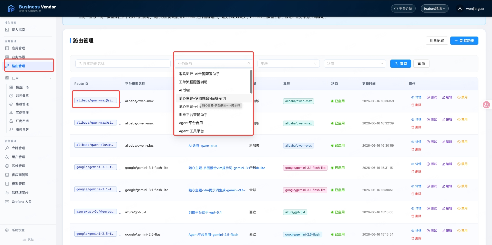

## 8.2 Token 使用规范

- `token` 由 Vendor 平台or 签发，不可写死到公开代码仓库
- 生产、测试环境令牌隔离（默认所有环境一致，可支持区分生产/测试，需单独说明）
- **Vendor 将根据 Token + businessSource + routeID 做业务串联校验**

## 8.3 appid 字段传递规范

- `appid` 由 TCS 平台签发，不可混用，标识业务方的唯一应用，**权限和校验会在 bus 网关层面拦截**
- **appid 是应用层面的成本分摊与计费字段，使用方务必规范使用**

## 8.4 businessSource 字段传递规范

- `businessSource` 当前由业务方提供，标识当前业务场景，维护在 TCS 平台，并按平台要求自行传递，且有**必填校验****，****因该字段涉及具体业务场景的成本分摊计算，****必须****规范使用****，****bus****将根据********appId********和****businessSource****做业务校验**
  - **businessSource 字段传值规范：{功能模块}@{子模块}** ，子模块没有的话就写功能模块
  - 数据示例：AIGCTheme2.0@Image2Theme，含义：随心主题 2.0 模块下的 图生主题图标
- 参数位置和传递规则，如下

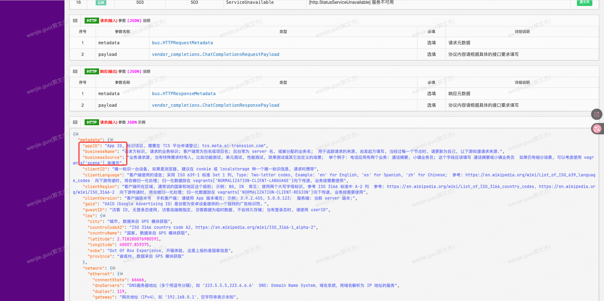

## 8.5 离线任务接入

- 添加http请求header， key:O-Env-Name； value:offline

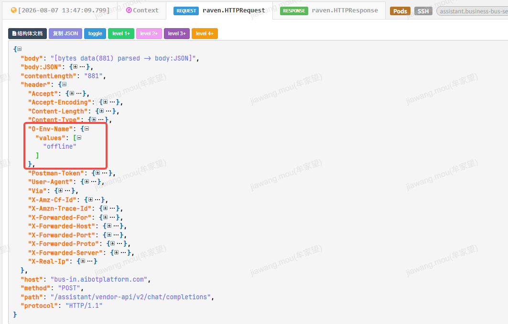

---

# 9 最小可用请求示例

## 9.1 流式示例

URL: https://bus-test-feature.aibotplatform.com/assistant/vendor-api/v2/chat/sse/completions

```java
{
        "metadata": {
                "clientRegion": "pk",
                "clientID": "35788096000522512",
                "clientLanguage": "zh_CN",
                "requestID": "0e794724-740d-4e14-b62a-5ad8671e2eb61780901091213",
                "appID": "YOUR APPID",
                "businessSource": "xxx"
        },
        "payload": {
                "standard": {
                        "messages": [{
                                "role": "user",
                                "content": [{
                                        "type": "text",
                                        "text": {
                                                "text": "你好，请简单介绍一下你自己。"
                                        }
                                }]
                        }],
                        "temperature": 0.7,
                        "maxCompletionTokens": 1024,
                        "stream": true
                },
                "inhouse": {
                        "token": "sk-xxx",
                        "model_cluster_id": "byteplus/seed-2.0-lite",
                        "routeID": "<your-route-id>"
                }
        }
}
```

## 9.2 非流式示例

URL: https://bus-test-feature.aibotplatform.com/assistant/vendor-api/v2/chat/completions

```java
{
        "metadata": {
                "clientRegion": "pk",
                "clientID": "35788096000522512",
                "clientLanguage": "zh_CN",
                "requestID": "3b75c611-279b-40d8-a022-7190058d76f41780902106951",
                "appID": "YOUR APPID",
                "businessSource": "xxx"
        },
        "payload": {
                "standard": {
                        "messages": [{
                                "role": "user",
                                "content": [{
                                        "type": "text",
                                        "text": {
                                                "text": "你好，请简单介绍一下你自己。"
                                        }
                                }]
                        }],
                        "temperature": 0.7,
                        "maxCompletionTokens": 1024,
                        "stream": false
                },
                "inhouse": {
                        "token": "sk-xxx",
                        "model_cluster_id": "byteplus/seed-2.0-lite",
                        "routeID": "<your-route-id>"
                }
        }
}
```

流式响应特征：

- HTTP 200
- Content-Type: text/event-stream
- 每个数据块以 data: ... 输出
- 正常结束时输出 data: [DONE]

---

## 9.3 工具调用示例

```java
{
        "metadata": {
                "clientRegion": "pk",
                "clientID": "35788096000522512",
                "clientLanguage": "zh_CN",
                "requestID": "bc437925-e031-4ff9-859e-fc28418ff5441780902277123",
                "appID": "YOUR APPID",
                "businessSource": "xxx"
        },
        "payload": {
                "standard": {
                        "messages": [{
                                "role": "user",
                                "content": [{
                                        "type": "text",
                                        "text": {
                                                "text": "北京今天天气怎么样？"
                                        }
                                }]
                        }],
                        "temperature": 0.7,
                        "maxCompletionTokens": 1024,
                        "stream": true,
                        "tools": [{
                                "type": "function",
                                "function": {
                                        "name": "get_weather",
                                        "description": "获取指定城市的当前天气信息",
                                        "parameters": {
                                                "type": "object",
                                                "properties": {
                                                        "location": {
                                                                "type": "string",
                                                                "description": "城市名称，例如：北京、上海"
                                                        },
                                                        "unit": {
                                                                "type": "string",
                                                                "enum": ["celsius", "fahrenheit"]
                                                        }
                                                },
                                                "required": ["location"]
                                        }
                                }
                        }],
                        "toolChoice": {
                                "toolChoiceMode": "auto"
                        }
                },
                "inhouse": {
                        "token": "sk-xxx",
                        "model_cluster_id": "byteplus/seed-2.0-lite",
                        "routeID": "<your-route-id>"
                }
        }
}
```

接入建议：

- 先用无工具版本完成基础联调
- 再开启工具调用
- 首次联调时，务必和平台方确认目标模型集群当前是否开通该能力

### 9.3.1 多轮工具调用示例

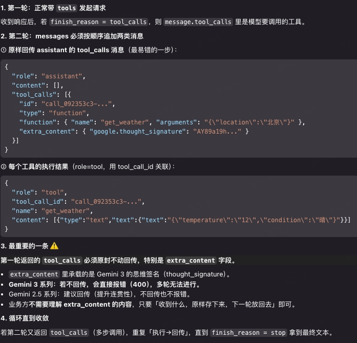

### 9.3.2 多模态+工具组合调用示例

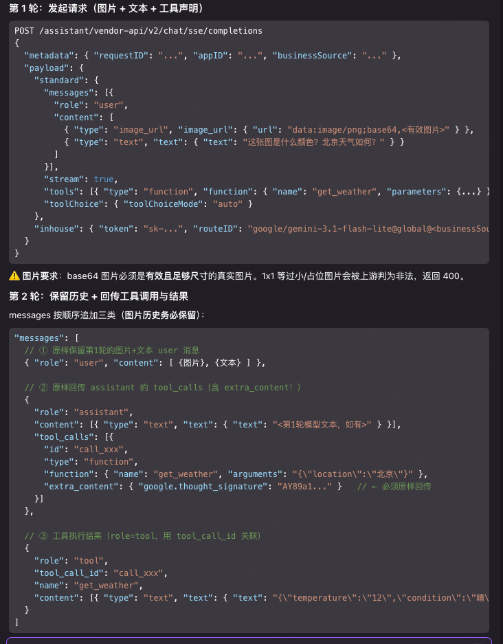

# 10 域名地址

## 10.1 **集群内访问推荐地址**

注：OP 生产，非本地生活集群内服务适用

### 10.1.1 **OP环境**

生产：

[http://ast-business-bus-server.assistant/assistant/vendor-api/v2/chat/sse/completions](http://ast-business-bus-server.assistant/assistant/vendor-api/v2/chat/sse/completions)

生产-本地生活集群使用：

[http://bus-ie.ai-transsion.com/assistant/vendor-api/v2/chat/completions](http://bus-ie.ai-transsion.com/assistant/vendor-api/v2/chat/completions)

[http://bus-ie.ai-transsion.com/assistant/vendor-api/v2/chat/sse/completions](http://bus-ie.ai-transsion.com/assistant/vendor-api/v2/chat/sse/completions)

测试project：

[http://ast-business-bus-server.assistant-test/assistant/vendor-api/v2/chat/sse/completions](http://ast-business-bus-server.assistant-test/assistant/vendor-api/v2/chat/sse/completions)

测试feature:

http://ast-business-bus-server.assistant-test-feature/assistant/vendor-api/v2/chat/sse/completions

### 10.1.2 **印度环境**

生产：

[http://ast-business-bus-server.assistant/assistant/vendor-api/v2/chat/sse/completions](http://ast-business-bus-server.assistant/assistant/vendor-api/v2/chat/sse/completions)

测试

http://ast-business-bus-server.assistant-test-india/assistant/vendor-api/v2/chat/sse/completions

### 10.1.3 **EE1环境**

生产：

[http://ast-business-bus-server.assistant/assistant/vendor-api/v2/chat/sse/completions](http://ast-business-bus-server.assistant/assistant/vendor-api/v2/chat/sse/completions)

测试：

http://ast-business-bus-server.assistant-test-ee1/assistant/vendor-api/v2/chat/sse/completions

## 10.2 本地调试地址（公网）

注：operation 环境暂无使用

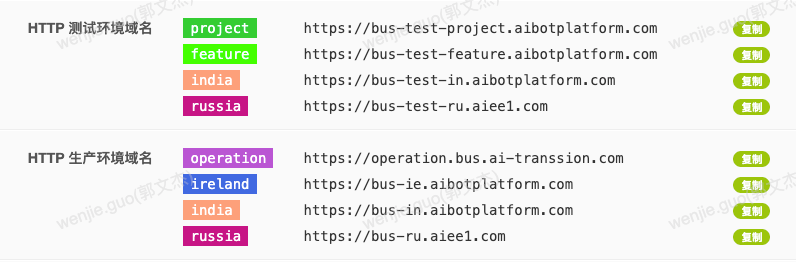

# 11 常见错误与归因

requestID 日志查询链路入口：https://test-sg.42.ai-transsion.com/journal

## 11.1 鉴权类

| 现象 | 典型原因 | 处理建议 |
| --- | --- | --- |
| `invalid token` | `payload.inhouse.token` 错误、失效或环境不匹配 | 联系平台重新核对令牌 |
| `token access denied` | 令牌未开通目标集群或实例权限 | 联系平台补访问规则 |

## 11.2 路由类

| 现象 | 典型原因 | 处理建议 |
| --- | --- | --- |
| 找不到模型 / 集群 | `model_cluster_id` 填错或未配置 | 联系平台核对路由配置 |
| 命中错误模型 | 路由策略或默认集群配置有误 | 带上 `requestID` 让平台查路由 |

## 11.3 厂商配置类

| 现象 | 典型原因 | 归因 |
| --- | --- | --- |
| `获取 Google access token 失败` | Gemini 厂商密钥配置错误 | 平台侧 |
| `缺少 client_email` | service account JSON 不完整 | 平台侧 |
| `invalid character '\\n' in string literal` | service account JSON 转义错误 | 平台侧 |

说明：

这类错误通常不是业务方请求体问题，而是平台维护的厂商凭证异常，应由平台侧处理。

## 11.4 配额 / 限流类

平台当前未增加限流能力，限流配置阈值参考调用的厂商模型

| 现象 | 典型原因 | 处理建议 |
| --- | --- | --- |
| 请求被限流 | QPS 超阈值 | 降流或联系平台扩容 |
| 配额不足 | 日 / 月额度耗尽 | 联系平台调整额度 |

---
